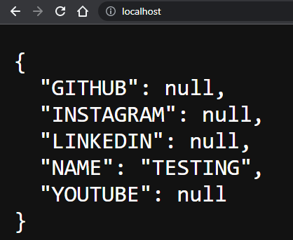
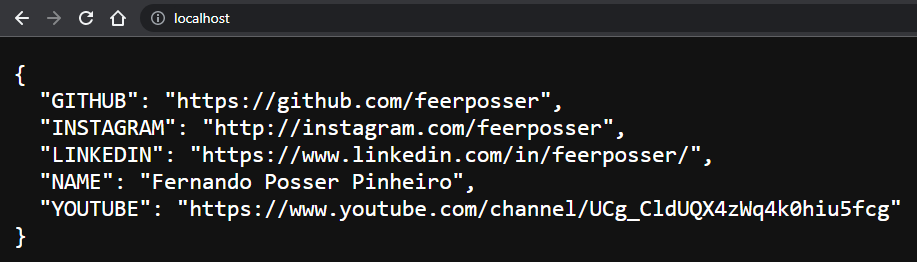

# Docker and docker compose .env file tutorial

Simple tutorial on how to use environment variables with Docker.

<small>For this example, we are going to use `Python Flask`, but you can use it with any other language and framework that you want.</small>
<small>Also, we're going to use `docker`and `docker compose`.</small>
 

 

 

## Why use .env files in our projects?
When we start to learn to program, commonly the basics tutorials for web dev show us the secrets in the project just like `SECRET=mysecretpasswordforcript` inside the main code. We run the project and everything is fine. And that's ok. But when we start to develop some more real-world features, this is not a good idea, mainly whether the project will be open source or be exposed to some other people inside or outside of the organization.

Above that, when developing an open source application that will run in some production environment (many times also in dev environment), probably it will use some key or auth method for the external access.

The source code will be exposed on our repo, and if we don't use different keys in dev environment and production environment, the security will be compromised.

There are many ways to organize secret keys in production and development environments. One of them using `Docker` or `Docker Compose` is implementing an `.env` file (or more than 1 file) and configuring our container or `docker-compose.yml` to start using the variables defined on this archive.

The main goal of doing that is to take off the secrets of our hard code and put them in some another file that will be loaded in the project and the secret values can be set dynamically.

After that, we can switch between an open file, which everyone can have access to, and the real file, which just you and the authorized users can have access to.

Enough talking, let's code.

 

 

## Let's get started

What is in this tutorial:
1. - [x] Run container using `Docker CLI` and loading variables with flags and .env file 
2. - [x] Hello world `Flask` app running and showing some environment variables from the container 
3. - [x] `.env` file with environment variables
4. - [x] A `Dockerfile` for building `Docker image`
5. - [x] A `docker-compose.yml` file for up the service container with environments variables

We're not going to learn Docker or Docker Compose from scratch. This tutorial assumes that you know the basics of each one of them.

 

 

### 1 - creating a docker image
> This section will be important if you're not running on docker compose where we can build an image automatically.

click to view

First things first, let's create the image that will be used to start the container. To do that just type it the following command inside the Dockerfile directory:

`docker build . -t docker-tutorial-image`

This will build an image based on Dockerfile with the tag 'docker-tutorial-image' or whatever other name you want.

After building it, you can check it out to have sure that everything is fine just typing the command below for to list all available images:

`docker images`

<small>If the build was executed with no error, you'd see its image in the list.</small>

 

 

### 1.1 - Docker run env with flags
> This section is for creating a simple container that loads environment variables in the container running with flags.

click to view

To start the container by using the image created in the last section, just type the following command:

`docker run -p 80:5000 --name testing -e NAME=myname -d docker-tutorial-image`

The command above with `-p` flag connects the 80 host port to the 5000 container port, which is the port running the Flask service. The `--name` flag sets a name to the container, which you can check by typing the command:

`docker ps`

and searching for the name column with a container called 'testing' or any name that you set. The `-e` flag is the one that inserts the variables in the container. The -e is followed by this syntax:

`VARIABLE=VALUE`

This will create inside the container an environment variable with the name and value that you type. After starting the container you can check it by accessing the container with command `docker exec -it container-name bash` and running the `set` command.

The `-d` flag runs the container in the background, and last but not least, the tag image used in the build section.

Now, we can open the browser and check the results by following the URL:

`http://localhost`.

As you can see, the API run inside the container returns a list with variables, where the 'NAME' variable has the value set in the -e flag. If you type more -e flags followed by VAR-NAME=VALUE, they will be shown in the browser.

<small>But just GITHUB, INSTAGRAM, LINKEDIN, NAME and YOUTUBE will appear because of the <a src="./tutorial/app.py">app.py</a> script behaviour. You can change it as you want.</small>

 

 

### 1.2 - Docker run with .env file
>Now we're talking! Let's start using .env files for real. In this section we will do the same as the last one, but this time with a `.env` file instead of a -e flag.

click to view

Loading values from archives is a very common way to deal with secrets in programming.

The [.env file](https://docs.docker.com/compose/env-file/) is a default method available in `Docker` and `Docker Compose` to start any service with the values inside the `.env`.

It is very simple to use. In the `.env` just write your variables one below the other with the following syntax: 
`VARIABLE_NAME=VALUE`

You can see it in the [.env file](./tutorial/.env) inside the tutorial folder. Sometimes, depending on the string format, the variables will use some special character(s) that can be interpreted by the shell as a comment or something similar. In this case, you can use [simple quotes to avoid the default behaviour](https://github.com/docker/compose/issues/8607#issuecomment-938235797): `VARNAME='VALUE'`.

In that way we can define files for being used in dev and production environment and switch between them, also managing which one you want to expose by using [.gitignore](https://git-scm.com/docs/gitignore).

To start a container loading a file, just type the command bellow inside the tutorial folder:

`docker run -p 80:5000 --name tutorial --env-file .env docker-tutorial-image`

The only news here is the `--env-file` flag, which is used to define the path to the file that will be used to load the environment variables to the container.

Now, if you open the `http://localhost` address:

All the variables inside .env are loaded to the container, which runs the Flask API that returns them to the browser.

 

 

### 2 docker-compose.yml file
> In this section we'll see how to use a .env file in a `docker-compose` project.

click do view

In [Docker Compose](https://docs.docker.com/compose/) things are a little bit different and with more clean commands. In the [docker-compose.yml](./tutorial/docker-compose.yaml) file there are some definitions that able us to just run the following command inside the tutorial folder to get everything up and running:

`docker compose up --build -d`

<small>Depending on the Docker environ version that you're using maybe run with 'docker-compose' instead.</small>

If you refresh the page, you will see the exact same result as before. Let's understand what just happened.

The `up` command is to set up and run the services defined inside the docker-compose file, while the `--build` flag is to build the image if the image doesn't exist (it must be configured in the build definition inside the docker-compose.yml service level. Without it, it won't work and you'll need to build the image on your own before starting the docker-compose) and `-d` flag is meant to run everything on background.

In the service level indentation, you'll find an `env_file` definition that uses the `.env` archive. It will load the file and bring the variables to the container config. 

Right below there is the `environment` definition. The syntax is very simple: `CONTAINER_VARIABLE=${ENV_FILE_VARIABLE}`. The values of the `.env file` variables will be stored in the container variables. Using that, you can just change the `env_file` path to switch between files that will be loaded in the service container.

After testing just execute the command to stop the container:
`docker compose down`

 

 

## Conclusion

In this simple example, we're just using a service API that returns the environment names and values of the variables. But I think you get the idea. The values inside the `.env` file can be used for hashing, cryptography, setting configs and all kinds of stuff.

You can also create a folder with multiple .env files just like `.env.production`, `production.env` or any file name syntax that you like for production and development too. In this way, you can handle the secrets exposures just by using the .gitignore file in your repo.

I hope this tutorial helps you to understand how to use environment variables with Docker or Docker Compose. Feel free to leave a comment for any errors ou just ask a question. 

Cheers!

Adiós!

Au revoir :)

Tchau (: